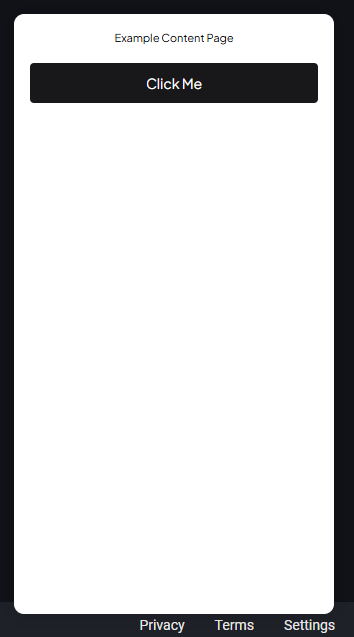

# Chakra UI Styles Break When Injected via Chrome Extension Using Shadow DOM

Please try `yarn build` to build the chrome extension and import `dist` folder into your browser to troubleshoot.

## Screenshot 1 (Works fine in most of web pages)

## Screenshot 2 (Styles are broken, on LinkedIn and Workable)

There are no paddings, font size becomes smaller than expected.

